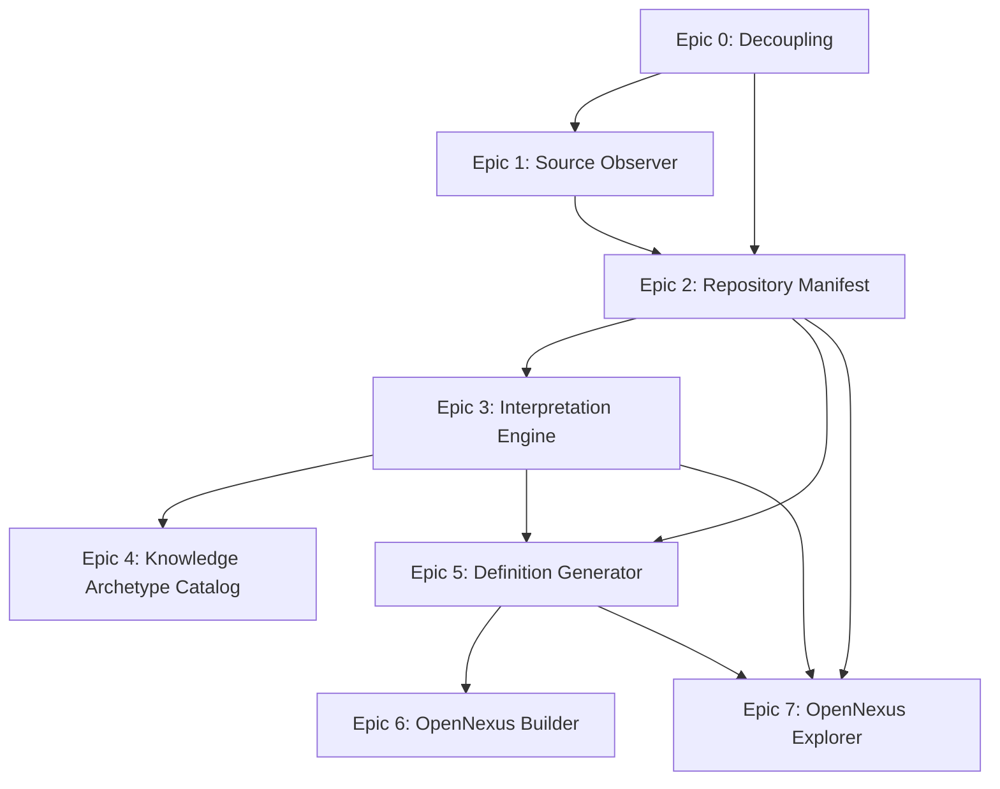
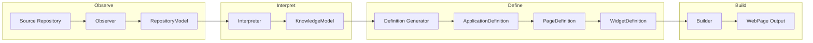
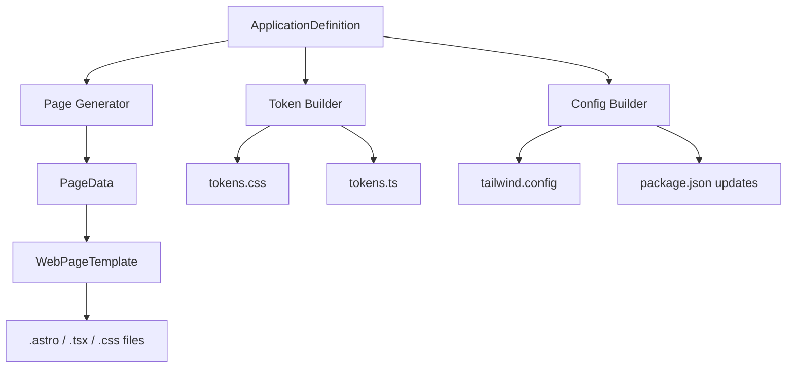
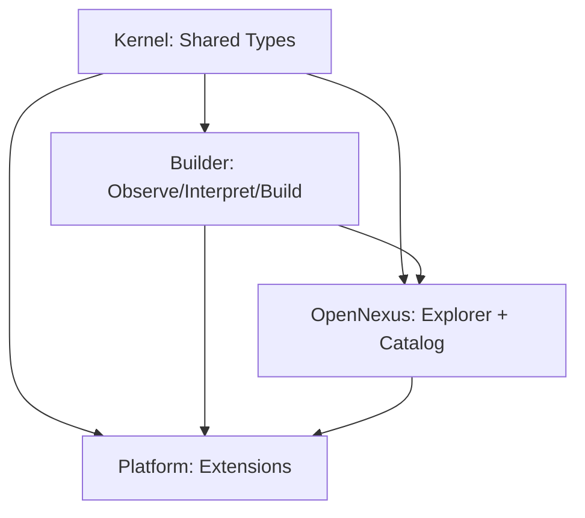

# OpenFav Migration Pipeline → Nexus Ecosystem: Operational Roadmap

> **Status:** Engineering Roadmap v1.0
> **Target:** Evolution from monolithic migration tool (v2.0.3) into a multi-stage, observable, interpretable, and generative ecosystem.
> **Last Updated:** 28 July 2026

---

## 1. Vision Statement

> **"The first responsibility of the Builder is understanding. Generation is a consequence of understanding."**

The Nexus ecosystem inverts the traditional "migrate-and-pray" approach. Instead of directly mutating source code through opaque pipelines, Nexus first **observes** the repository to produce a technology-independent model, then **interprets** that model into a knowledge graph, **derives** structured definitions from that knowledge, and only then **builds** artifacts. Every stage produces a verifiable, diffable artifact. This makes the system auditable, debuggable, and — critically — testable at each boundary.

### Design Principles

| Principle | Meaning |
|-----------|---------|
| **Application First, not Page First** | The strategic object is the Application — pages are derived from it, not the other way around |
| **Artifact at every boundary** | Every stage transition produces a JSON file on disk. No invisible state |
| **Technology-independent models** | `RepositoryModel` and `KnowledgeModel` have zero framework-specific assumptions |
| **AI only where judgment is needed** | AI/ML belongs exclusively in the Interpretation stage. Observation and Building are deterministic |
| **Four independent velocities** | Kernel (slow/stable), Builder (fast/iterative), OpenNexus (experience-first), Platform (ecosystem) |

---

## 2. Current State Summary (v2.0.3)

### 2.1 What We Have Today

The current `openfav-migration-pipeline` v2.0.3 is a **working, tested, clean** Node.js CLI tool focused on design token migration.

#### Architecture (flat structure)

```
src/
├── cli.js                          # Commander-based CLI (setup, validate, migrate, seed-templates)
├── commands/
│   └── seed-templates.js           # Template seeding command
├── core/
│   ├── config-loader.js            # Zod-validated config (migration.config.json)
│   ├── template-generator.js       # Generates tokens.ts + globals.css with @inject tags
│   └── token-engine.js             # Orchestrates extract → hydrate
├── pipeline/
│   └── migration-engine.js         # Two-pass: template generation → extract & hydrate
├── modules/
│   ├── extractors/
│   │   └── css-extractor.js        # Regex-based CSS variable extraction (glob → read → classify)
│   └── hydrators/
│       └── token-hydrator.js       # Injects tokens into V6 templates via @inject:key tags
├── injectors/
│   └── injector-engine.js          # File-level regex injection engine with dry-run
├── transformers/
│   └── color-transformer.js        # HEX → Pure HSL conversion
└── utils/
    └── logger.js                   # Colored console logging (info/success/warning/error/debug)
```

#### Test Suite (16/16 passing, Vitest)

| Module | Coverage |
|--------|----------|
| `config-loader` | 100% |
| `token-engine` | Covered (integration) |
| `css-extractor` | Covered |
| `token-hydrator` | Covered |
| `injector-engine` | Covered |
| `color-transformer` | Covered |
| `logger` | 100% |
| `cli` | Covered |
| `template-generator` | Covered |
| Full pipeline (integration) | Covered |

#### Dependencies (minimal)

- **Runtime:** `chalk`, `commander`, `glob`, `inquirer`, `zod`
- **Dev:** `vitest`, `@vitest/coverage-v8`

### 2.2 What We Don't Have (Gaps)

| Gap | Severity | Why It Matters |
|-----|----------|----------------|
| No shared type definitions | Critical | Every module speaks a different ad-hoc object shape; no TypeScript interfaces exist |
| No technology-independent model | Critical | The extractor produces CSS-specific data — useless for HTML, JSX, or routing analysis |
| No repository-level awareness | High | Only CSS files are scanned. No knowledge of pages, components, routes, or imports |
| No interpretation layer | High | Tokens are classified by regex only. No semantic understanding of _what_ a token represents |
| No build pipeline beyond token injection | High | Migration stops at CSS variables. No component, page, or application generation |
| No visualization/explorer | Medium | Users cannot see what was observed or how it was interpreted |
| No multi-framework architecture | Medium | Everything is hardwired to V4→V6 CSS migration |
| Flat directory structure | Low | `modules/extractors/`, `modules/hydrators/` won't scale to N modules |

### 2.3 What This Roadmap Addresses

The Nexus evolution transforms this single-purpose tool into a **four-board ecosystem** where:

1. The old token migration pipeline becomes the kernel of the **Builder** board
2. New capabilities (observation, interpretation, definition) form the **OpenNexus** board
3. Shared types and contracts form the **Kernel** board
4. Integrations and extensions form the **Platform** board

---

## 3. Epic Breakdown

### 3.1 Epic Dependency Graph



### 3.2 Data Flow Across Epics



---

### Epic 0 — Disaccoppiamento (Decoupling)

> **Theme:** "Separate to understand. Understand to build."
> **Duration:** Foundation — must complete before any other Epic

#### Objective

Restructure the flat `src/` directory into four conceptually independent subsystems. This is a pure refactoring exercise — zero behavioral changes, zero new features. The goal is to establish the directory contract that all subsequent Epics will fill.

#### Inputs

- Current `src/` directory (flat structure)
- 16 passing tests

#### Outputs (Directory Structure)

```
src/
├── observer/           # "What is in this repository?" — reads source code
│   ├── index.ts        # Public API: observeRepository(path) → RepositoryModel
│   └── css-observer.ts # Extracted from modules/extractors/css-extractor.js
├── interpreter/        # "What does this repository mean?" — AI-powered
│   ├── index.ts        # Public API: interpret(repositoryModel) → KnowledgeModel
│   └── (future)        # Domain classifiers, intent detectors, pattern matchers
├── definitions/         # "What should we build?" — generates structured specs
│   ├── index.ts         # Public API: define(knowledgeModel) → ApplicationDefinition
│   ├── application.ts  # ApplicationDefinition schema + generator
│   ├── page.ts         # PageDefinition schema + generator
│   └── widget.ts       # WidgetDefinition schema + generator
├── builder/             # "Build it." — generates actual output files
│   ├── index.ts         # Orchestrates the build pipeline
│   ├── css-builder.ts   # Migrated from modules/hydrators/ + template-generator
│   └── (future)         # Component builder, page builder, app builder
├── shared/              # ⭐ FIRST CONCRETE DELIVERABLE
│   └── types/           # Domain type definitions — the common language
│       ├── repository.ts    # RepositoryModel + all node types
│       ├── knowledge.ts     # KnowledgeModel + Domain, Intent, Entity, etc.
│       ├── definitions.ts   # ApplicationDefinition, PageDefinition, WidgetDefinition
│       └── manifest.ts      # RepositoryManifest (umbrella type)
├── cli.ts               # Renamed entry point: "nexus" CLI
├── core/                # ⚠️ DEPRECATED — functions migrate to subsystems above
├── modules/             # ⚠️ DEPRECATED — functions migrate to subsystems above
├── injectors/           # ⚠️ DEPRECATED — merged into builder/
├── transformers/        # ⚠️ DEPRECATED — merged into builder/
└── utils/
    └── logger.ts        # KEPT — still useful across all subsystems
```

#### Deliverables

| # | Deliverable | Type | Description |
|---|-------------|------|-------------|
| 0.1 | `src/shared/types/repository.ts` | New file | `RepositoryModel` interface + all node subtypes |
| 0.2 | `src/shared/types/knowledge.ts` | New file | `KnowledgeModel` interface + Domain, Intent, Entity, etc. |
| 0.3 | `src/shared/types/definitions.ts` | New file | `ApplicationDefinition`, `PageDefinition`, `WidgetDefinition` |
| 0.4 | `src/shared/types/manifest.ts` | New file | `RepositoryManifest` — umbrella for interchange |
| 0.5 | `src/shared/types/index.ts` | New file | Barrel export |
| 0.6 | `src/observer/index.ts` | New file | Module contract: `observeRepository(path) → RepositoryModel` |
| 0.7 | `src/observer/css-observer.ts` | Refactored | Extracted from `modules/extractors/css-extractor.js` |
| 0.8 | `src/interpreter/index.ts` | New file (stub) | Module contract: `interpret(RepositoryModel) → KnowledgeModel` |
| 0.9 | `src/definitions/index.ts` | New file (stub) | Module contract: `define(KnowledgeModel) → ApplicationDefinition` |
| 0.10 | `src/builder/index.ts` | Refactored | Merged from `pipeline/migration-engine.js` + `core/token-engine.js` |
| 0.11 | `src/builder/css-builder.ts` | Refactored | Merged from `template-generator` + `token-hydrator` + `injector-engine` |
| 0.12 | `src/cli.ts` | Updated | New `nexus` CLI with `observe`, `interpret`, `define`, `build` commands |
| 0.13 | All 16 existing tests | Updated imports | Tests pass with new file paths |

#### Acceptance Criteria

- [ ] All 16 existing tests pass with zero changes to test _logic_ (import paths only)
- [ ] `nexus migrate` (old command) still works identically to v2.0.3
- [ ] New `nexus observe` command exists and outputs valid (but empty) `RepositoryModel`
- [ ] New `nexus interpret` command exists (stub — outputs empty `KnowledgeModel`)
- [ ] New `nexus define` command exists (stub — outputs empty `ApplicationDefinition`)
- [ ] New `nexus build` command exists (functional — wraps existing migration pipeline)
- [ ] All shared types compile without errors
- [ ] `npm test` exits 0

---

### Epic 1 — Source Observer

> **Theme:** "See everything. Assume nothing."
> **Dependency:** Epic 0 (shared types + observer directory must exist)

#### Objective

Extract the CSS scanning logic from [`css-extractor.js`](src/modules/extractors/css-extractor.js:19) and generalize it into a multi-file observer that produces a complete `RepositoryModel` — a technology-independent snapshot of the entire source repository, not just CSS.

#### RepositoryModel Schema

```ts
// src/shared/types/repository.ts

interface RepositoryModel {
  metadata: RepositoryMetadata;
  pages: PageNode[];
  components: ComponentNode[];
  routes: RouteNode[];
  imports: ImportNode[];
  styles: StyleNode[];
  tokens: TokenNode[];
  apis: ApiNode[];
}

interface RepositoryMetadata {
  name: string;
  rootPath: string;
  framework: 'react' | 'vue' | 'astro' | 'svelte' | 'unknown';
  stylingApproach: 'tailwind' | 'css-modules' | 'styled-components' | 'scss' | 'css' | 'mixed';
  fileCount: number;
  analyzedAt: string; // ISO 8601
  version: string;    // Observer version
}

interface PageNode {
  id: string;
  filePath: string;
  type: 'page' | 'layout' | 'template';
  framework: string;     // 'astro', 'react', etc.
  route: string | null;  // Parsed route if detectable
  exports: string[];     // Named/default exports
  childComponents: string[]; // IDs of ComponentNodes used
  dataFetching: DataFetchingNode | null;
}

interface ComponentNode {
  id: string;
  filePath: string;
  type: 'ui' | 'container' | 'layout' | 'unknown';
  framework: string;
  props: PropNode[];
  exports: string[];
  usedBy: string[];       // Page/Component IDs that import this
  styles: string[];       // StyleNode IDs associated
}

interface RouteNode {
  id: string;
  path: string;
  pageId: string;
  method: 'get' | 'static';
  params: string[];       // Dynamic route params: ['id', 'slug']
}

interface ImportNode {
  id: string;
  sourceFile: string;
  targetModule: string;
  importType: 'default' | 'named' | 'namespace' | 'side-effect';
  importedNames: string[];
  isExternal: boolean;    // node_modules vs project-local
}

interface StyleNode {
  id: string;
  filePath: string;
  type: 'css' | 'scss' | 'tailwind' | 'css-in-js' | 'inline';
  associatedComponent: string | null; // ComponentNode id
  tokenCount: number;
  rawTokens: RawToken[];
}

interface TokenNode {
  id: string;
  name: string;
  value: string;
  category: 'color' | 'spacing' | 'typography' | 'radius' | 'shadow' | 'custom';
  sourceFile: string;
  sourceLine: number;
  normalizedName: string;  // Post-normalization (e.g., --color-primary-color → primary)
}

interface ApiNode {
  id: string;
  url: string;
  method: 'GET' | 'POST' | 'PUT' | 'DELETE' | 'PATCH';
  usedBy: string[];       // Component/Page IDs
  responseShape: string | null; // Rudimentary type inference
}

interface PropNode {
  name: string;
  type: string;           // Inferred or explicit
  required: boolean;
  defaultValue: unknown | null;
}

interface DataFetchingNode {
  pattern: 'useEffect+fetch' | 'getStaticProps' | 'loader' | 'Astro.fetch' | 'unknown';
  endpoints: string[];
}

interface RawToken {
  name: string;
  value: string;
  line: number;
}
```

#### Observer Architecture

```
src/observer/
├── index.ts              # orchestrateObservers(path) → RepositoryModel
├── css-observer.ts       # Migrated + enhanced from css-extractor.js
├── page-observer.ts      # NEW: Scan for page files (.astro, page.tsx, etc.)
├── component-observer.ts # NEW: Scan for component files, extract props/exports
├── route-observer.ts     # NEW: Detect routing patterns (file-based, config-based)
├── import-observer.ts    # NEW: Build import graph
├── api-observer.ts       # NEW: Detect fetch/axios calls, build API map
├── framework-detector.ts # NEW: Heuristic framework detection (package.json, file patterns)
└── __tests__/
    ├── css-observer.test.ts
    ├── page-observer.test.ts
    ├── component-observer.test.ts
    └── integration/
        └── full-observe.test.ts  # End-to-end: real repo → valid RepositoryModel
```

#### CLI Command

```bash
nexus observe --source ./my-project --output repository.manifest.json
```

#### Deliverables

| # | Deliverable | Description |
|---|-------------|-------------|
| 1.1 | `src/observer/css-observer.ts` | Migrated CSS extractor, now outputting `StyleNode[]` + `TokenNode[]` |
| 1.2 | `src/observer/framework-detector.ts` | Analyze package.json + file patterns → `RepositoryMetadata.framework` |
| 1.3 | `src/observer/page-observer.ts` | Scan `.astro`, `page.tsx`, `index.tsx` → `PageNode[]` |
| 1.4 | `src/observer/component-observer.ts` | Scan `.tsx`, `.jsx`, `.vue` → `ComponentNode[]` with props detection |
| 1.5 | `src/observer/route-observer.ts` | File-based and config-based routing → `RouteNode[]` |
| 1.6 | `src/observer/import-observer.ts` | Parse import statements → `ImportNode[]` |
| 1.7 | `src/observer/api-observer.ts` | Detect fetch/axios → `ApiNode[]` |
| 1.8 | `src/observer/index.ts` | Orchestrator: runs all observers, merges into `RepositoryModel` |
| 1.9 | `nexus observe` CLI command | Fully functional with `--output`, `--format json|yaml` |
| 1.10 | Tests (target >90% coverage on observer/) | Unit + integration tests with fixture repos |

#### Acceptance Criteria

- [ ] `nexus observe --source ./fixtures/react-app` produces valid `RepositoryModel` JSON
- [ ] `RepositoryModel` validates against Zod schema (no partial data)
- [ ] CSS tokens are correctly classified into `TokenNode[]` with normalized names
- [ ] Page files are detected with correct framework tags
- [ ] Import graph is complete (no dangling references)
- [ ] API endpoints are detected
- [ ] Fixture test: React+Vite app → 100% node detection
- [ ] Fixture test: Astro app → correct page/component classification
- [ ] Test coverage >90% on `src/observer/`

---

### Epic 2 — Repository Manifest

> **Theme:** "A single source of truth for the entire ecosystem."
> **Dependency:** Epic 1 (needs actual RepositoryModel data to validate manifest)

#### Objective

Define and implement the `RepositoryManifest` — the JSON interchange format that is the **universal contract** between all Nexus subsystems and external tools. This is not just a wrapper: it is versioned, validated, and carries provenance metadata.

#### RepositoryManifest Schema

```ts
// src/shared/types/manifest.ts

interface RepositoryManifest {
  schemaVersion: string;       // Semantic version of the manifest format (e.g., "1.0.0")
  generatedAt: string;         // ISO 8601
  generatedBy: string;         // "nexus-observer/1.0.0"
  sourcePath: string;
  
  metadata: RepositoryMetadata;
  repositoryModel: RepositoryModel;
  
  // Populated by Epic 3
  knowledgeModel: KnowledgeModel | null;
  
  // Populated by Epic 5
  definitions: {
    application: ApplicationDefinition | null;
    pages: PageDefinition[];
    widgets: WidgetDefinition[];
  } | null;
  
  // Checksums for integrity
  checksums: {
    repositoryModel: string;   // SHA-256
    knowledgeModel: string | null;
    definitions: string | null;
  };
}
```

#### Design Decisions

- **One file per project** — not split across multiple files. This makes it trivial to share, cache, and checksum.
- **Nullable future sections** — `knowledgeModel` and `definitions` are `null` until their respective Epics populate them. This allows progressive enrichment.
- **SHA-256 checksums** — each model section has an independent checksum. A consumer can verify "the repository model hasn't changed since I last interpreted it."

#### CLI Commands

```bash
nexus observe --output manifest.json           # Generates manifest with only repositoryModel populated
nexus interpret --manifest manifest.json       # Adds knowledgeModel
nexus define --manifest manifest.json          # Adds definitions
nexus manifest validate manifest.json          # Validates schema + checksums
nexus manifest diff manifest-v1.json manifest-v2.json  # Diffs two manifests
```

#### Deliverables

| # | Deliverable | Description |
|---|-------------|-------------|
| 2.1 | `src/shared/types/manifest.ts` (finalized) | Complete `RepositoryManifest` type with all sub-types |
| 2.2 | `src/shared/manifest-validator.ts` | Zod schema + SHA-256 checksum validation |
| 2.3 | `src/shared/manifest-io.ts` | Read/write manifest with atomic writes (write to .tmp → rename) |
| 2.4 | `nexus manifest validate` command | Validates structure, schema, and checksums |
| 2.5 | `nexus manifest diff` command | Semantic diff between two manifests (not line-based) |
| 2.6 | Manifest JSON Schema | Published JSON Schema for external tooling |
| 2.7 | Tests | Round-trip tests, checksum integrity tests, schema evolution tests |

#### Acceptance Criteria

- [ ] `RepositoryManifest` with only `repositoryModel` passes validation
- [ ] `RepositoryManifest` with all sections populated passes validation
- [ ] Tampered checksum → validation fails with clear error
- [ ] `manifest diff` shows added/removed/changed nodes between versions
- [ ] Atomic writes: interrupted write does not corrupt existing manifest
- [ ] JSON Schema validates against external validators (ajv, etc.)

---

### Epic 3 — Interpretation Engine

> **Theme:** "AI-powered, but only here."
> **Dependency:** Epic 2 (manifest format must be stable before interpretation)

#### Objective

Transform the technology-independent `RepositoryModel` into a semantic `KnowledgeModel`. This is the **only** stage where AI/ML is permitted. All other stages are deterministic.

The interpretation engine answers questions like:
- "Is this a landing page or a dashboard?"
- "What domain does this project belong to?"
- "What are the core entities in this codebase?"
- "What user intents are served by these pages?"
- "What design patterns are in use?"

#### KnowledgeModel Schema

```ts
// src/shared/types/knowledge.ts

interface KnowledgeModel {
  generatedAt: string;
  interpreterVersion: string;
  confidence: number;       // Overall confidence score (0.0–1.0)
  
  domains: Domain[];
  intents: Intent[];
  entities: Entity[];
  relationships: Relationship[];
  patterns: Pattern[];
  archetypes: ArchetypeMatch[];
}

interface Domain {
  id: string;
  name: string;             // e.g., "E-commerce", "SaaS Dashboard", "Blog"
  confidence: number;
  evidence: string[];       // References to RepositoryModel nodes that support this
}

interface Intent {
  id: string;
  name: string;             // e.g., "Browse Products", "User Authentication", "View Analytics"
  type: 'informational' | 'transactional' | 'navigational' | 'functional';
  servedBy: string[];       // PageNode IDs
  confidence: number;
}

interface Entity {
  id: string;
  name: string;             // e.g., "User", "Product", "Order"
  type: 'model' | 'view' | 'controller' | 'config' | 'unknown';
  sourceComponents: string[]; // ComponentNode IDs that define/use this entity
  attributes: EntityAttribute[];
}

interface EntityAttribute {
  name: string;
  type: string;             // Inferred type
  required: boolean;
}

interface Relationship {
  id: string;
  from: string;             // Entity ID
  to: string;               // Entity ID
  type: 'has-many' | 'belongs-to' | 'has-one' | 'many-to-many' | 'uses' | 'extends';
  evidence: string[];       // ImportNode/ComponentNode references
}

interface Pattern {
  id: string;
  name: string;             // e.g., "Container/Presentational", "Compound Components"
  type: 'architecture' | 'design' | 'routing' | 'data-flow';
  locations: string[];      // ComponentNode/PageNode IDs exhibiting this pattern
  confidence: number;
}

interface ArchetypeMatch {
  archetypeId: string;      // References KnowledgeArchetypeCatalog (Epic 4)
  archetypeName: string;    // e.g., "Dashboard", "Landing", "Authentication"
  matchedPages: string[];   // PageNode IDs
  matchedComponents: string[]; // ComponentNode IDs
  confidence: number;
  rationale: string;        // Why this archetype was matched
}
```

#### Interpreter Architecture

```
src/interpreter/
├── index.ts                  # interpret(repositoryModel) → KnowledgeModel
├── domain-classifier.ts      # Heuristic + AI: project → Domain[]
├── intent-detector.ts        # Page analysis → Intent[]
├── entity-extractor.ts       # Component analysis → Entity[]
├── relationship-mapper.ts    # Import graph analysis → Relationship[]
├── pattern-recognizer.ts     # Code structure analysis → Pattern[]
├── archetype-matcher.ts      # Pattern matching against catalog → ArchetypeMatch[]
├── ai/
│   ├── provider.ts           # Abstract AI provider interface
│   ├── openai-provider.ts    # OpenAI implementation
│   └── prompts/
│       ├── domain.prompt.ts
│       ├── intent.prompt.ts
│       └── entity.prompt.ts
└── __tests__/
    └── (test fixtures with known interpretations)
```

#### CLI Commands

```bash
nexus interpret --manifest manifest.json --output manifest.json   # In-place enrichment
nexus interpret --manifest manifest.json --model openai/gpt-4o    # AI model selection
nexus interpret --manifest manifest.json --dry-run                # Preview without writing
```

#### Deliverables

| # | Deliverable | Description |
|---|-------------|-------------|
| 3.1 | `src/interpreter/index.ts` | Orchestrator: runs all classifiers, merges into `KnowledgeModel` |
| 3.2 | `src/interpreter/domain-classifier.ts` | Rule-based + optional AI domain classification |
| 3.3 | `src/interpreter/intent-detector.ts` | Page content analysis → user intents |
| 3.4 | `src/interpreter/entity-extractor.ts` | Component prop/state analysis → domain entities |
| 3.5 | `src/interpreter/relationship-mapper.ts` | Import graph → entity relationships |
| 3.6 | `src/interpreter/pattern-recognizer.ts` | Code structure → design/architecture patterns |
| 3.7 | `src/interpreter/archetype-matcher.ts` | Match against Knowledge Archetype Catalog (Epic 4) |
| 3.8 | `src/interpreter/ai/provider.ts` | Pluggable AI provider interface |
| 3.9 | `src/interpreter/ai/openai-provider.ts` | OpenAI implementation |
| 3.10 | Tests | Baseline: rule-based classifiers produce consistent output on fixtures |

#### Acceptance Criteria

- [ ] Rule-based classifiers produce deterministic, repeatable output
- [ ] AI provider is optional — system works without API key (reduced confidence, but functional)
- [ ] `KnowledgeModel` confidence scores are honest (0.0 when uncertain, not 0.5 as default)
- [ ] Each classification includes `evidence` references back to `RepositoryModel` nodes
- [ ] Manifest enrichment preserves existing `repositoryModel` checksum
- [ ] Test fixtures: known React app → expected entities, patterns, archetypes

---

### Epic 4 — Knowledge Archetype Catalog

> **Theme:** "Patterns that repeat across projects."
> **Dependency:** Epic 3 (archetypes are meaningless without an interpretation engine to match against them)

#### Objective

Define a catalog of reusable archetypes — common application patterns that the interpretation engine can match against. This is a **data artifact**, not code. It's a JSON file that grows over time as we analyze more projects.

#### Predefined Archetypes

| Archetype | Description | Typical Signals |
|-----------|-------------|-----------------|
| **Landing** | Marketing/landing page | Single page, hero section, CTA, features grid, no auth |
| **Authentication** | Login/register flows | Login/signup pages, auth providers, token management |
| **Documentation** | Docs/knowledge base | MDX/Markdown pages, sidebar navigation, search |
| **Dashboard** | Data dashboards | Charts, stats cards, data tables, filtering |
| **Collections** | List/detail views | List pages, detail pages, pagination, search, filters |
| **Knowledge Browser** | Exploratory browsing | Tag-based navigation, search, related content |
| **Workflow** | Multi-step processes | Wizard/steps, form validation, progress indicators |
| **Settings** | Configuration panels | Form-heavy, tabs/sections, save/reset patterns |
| **Administration** | Admin panels | CRUD operations, user management, role-based access |
| **Catalog** | Product/service catalogs | Grid/list toggle, filters, sorting, product cards |
| **Search** | Search experiences | Search bar, results list, facets, autocomplete |

#### Archetype Schema

```ts
interface KnowledgeArchetype {
  id: string;
  name: string;
  description: string;
  category: 'page' | 'application' | 'component';
  
  signals: {
    pages: PageSignal[];         // Page-level indicators
    components: ComponentSignal[]; // Component-level indicators
    routing: RouteSignal[];      // Routing patterns
    dataFlow: DataFlowSignal[];  // Data fetching patterns
    styling: StyleSignal[];      // Styling indicators
  };
  
  typicalEntities: string[];     // e.g., ["Product", "Cart", "Order"] for Catalog
  typicalIntents: string[];      // e.g., ["Browse Products", "Compare Items"]
  typicalPatterns: string[];     // e.g., ["Repository Pattern", "Observer Pattern"]
  
  examples: string[];            // Links to reference implementations
}

interface PageSignal {
  indicator: string;             // e.g., "contains hero section", "has CTA button"
  weight: number;                // 0.0–1.0
  detectionMethod: 'filename' | 'content' | 'structure' | 'routing';
}

// ... (ComponentSignal, RouteSignal, DataFlowSignal, StyleSignal similar)
```

#### Catalog Storage

```
src/interpreter/catalog/
├── index.ts                  # Loads and indexes all archetypes
├── archetypes/
│   ├── landing.json
│   ├── authentication.json
│   ├── documentation.json
│   ├── dashboard.json
│   ├── collections.json
│   ├── knowledge-browser.json
│   ├── workflow.json
│   ├── settings.json
│   ├── administration.json
│   ├── catalog.json
│   └── search.json
└── __tests__/
    └── catalog.test.ts       # Validates all archetypes against schema
```

#### Deliverables

| # | Deliverable | Description |
|---|-------------|-------------|
| 4.1 | `KnowledgeArchetype` type definition | Schema in `src/shared/types/knowledge.ts` |
| 4.2 | `src/interpreter/catalog/index.ts` | Archetype loader + matcher |
| 4.3 | 11 archetype JSON files | One per predefined archetype |
| 4.4 | Archetype validation test | Every JSON file validates against schema |
| 4.5 | Archetype completeness test | Every archetype has signals, entities, intents, patterns |

#### Acceptance Criteria

- [ ] All 11 archetypes validate against the `KnowledgeArchetype` schema
- [ ] Archetype matcher correctly identifies a landing page fixture
- [ ] Archetype matcher correctly identifies a dashboard fixture
- [ ] Archetype matcher returns `confidence: 0.0` for an unrecognizable fixture (no false positives)
- [ ] New archetypes can be added as JSON files without code changes

---

### Epic 5 — Definition Generator

> **Theme:** "Application First, not Page First."
> **Dependency:** Epic 3 (needs KnowledgeModel) + Epic 2 (needs manifest)

#### Objective

Transform the `KnowledgeModel` into structured, actionable definitions. The key architectural decision: the primary artifact is the `ApplicationDefinition` — the strategic object that describes the entire application. Pages and widgets are derived from it, not defined independently.

This is the "what to build" stage — it produces specs, not code.

#### Definition Schemas

```ts
// src/shared/types/definitions.ts

interface ApplicationDefinition {
  id: string;
  name: string;
  description: string;
  domain: string;
  
  // Strategic decisions
  architecture: 'spa' | 'mpa' | 'ssr' | 'ssg' | 'islands';
  framework: 'astro' | 'nextjs' | 'remix' | 'nuxt' | 'sveltekit';
  stylingStrategy: 'tailwind' | 'css-modules' | 'styled-components';
  
  // Derived from KnowledgeModel
  entities: EntityDefinition[];
  
  // Pages are derived from the application, not defined independently
  pages: PageDefinition[];
  
  // Global concerns
  navigation: NavigationDefinition;
  theming: ThemeDefinition;
  authentication: AuthDefinition | null;
  
  // Metadata
  generatedAt: string;
  sourceManifest: string;  // Path to originating manifest
  confidence: number;
}

interface PageDefinition {
  id: string;
  title: string;
  route: string;
  archetype: string;              // References KnowledgeArchetype
  layout: 'default' | 'full-width' | 'sidebar' | 'minimal' | 'dashboard';
  
  // Content model
  sections: PageSectionDefinition[];
  dataDependencies: DataDependency[];
  
  // Component assignments
  widgets: WidgetAssignment[];
  
  // Behavior
  seo: SeoDefinition;
  access: 'public' | 'authenticated' | 'admin';
  caching: 'static' | 'dynamic' | 'hybrid';
}

interface WidgetDefinition {
  id: string;
  name: string;
  type: 'hero' | 'features' | 'cta' | 'card-grid' | 'data-table' | 'chart' 
      | 'form' | 'list' | 'detail' | 'search' | 'navigation' | 'footer' | 'custom';
  
  // Data contract
  props: WidgetProp[];
  dataSource: 'static' | 'props' | 'api' | 'context';
  
  // Rendering hints
  responsive: 'static' | 'adaptive' | 'responsive';
  interactivity: 'static' | 'hydrated' | 'spa';
  
  // Source mapping
  sourceComponent: string | null;  // Original ComponentNode ID (for migration)
}

// Supporting types
interface EntityDefinition {
  name: string;
  attributes: { name: string; type: string; required: boolean }[];
  relationships: { entity: string; type: string }[];
}

interface NavigationDefinition {
  type: 'header' | 'sidebar' | 'both' | 'none';
  items: NavItemDefinition[];
}

interface NavItemDefinition {
  label: string;
  route: string;
  icon: string | null;
  children: NavItemDefinition[];
  access: 'public' | 'authenticated' | 'admin';
}

interface ThemeDefinition {
  mode: 'light' | 'dark' | 'system';
  primaryColor: string;
  fonts: { heading: string; body: string; mono: string };
  borderRadius: string;
}

interface AuthDefinition {
  providers: string[];
  protectedRoutes: string[];
  publicRoutes: string[];
}

interface PageSectionDefinition {
  id: string;
  type: 'hero' | 'features' | 'content' | 'cta' | 'testimonials' | 'stats' | 'custom';
  order: number;
  widgetId: string;  // WidgetDefinition ID that renders this section
}

interface DataDependency {
  entity: string;
  endpoint: string;
  method: string;
  loadingState: 'skeleton' | 'spinner' | 'none';
  errorState: 'toast' | 'inline' | 'redirect';
}

interface WidgetAssignment {
  widgetId: string;
  sectionId: string;
  props: Record<string, unknown>;
}

interface WidgetProp {
  name: string;
  type: string;
  required: boolean;
  defaultValue: unknown | null;
  source: 'static' | 'entity' | 'api' | 'computed';
}

interface SeoDefinition {
  title: string;
  description: string;
  ogImage: string | null;
  canonical: string | null;
}
```

#### Definition Generator Architecture

```
src/definitions/
├── index.ts                  # define(knowledgeModel) → ApplicationDefinition
├── application-generator.ts  # KnowledgeModel → ApplicationDefinition
├── page-generator.ts         # ApplicationDefinition context → PageDefinition[]
├── widget-generator.ts       # ComponentNode + Entity → WidgetDefinition[]
├── navigation-generator.ts   # RouteNode[] + archetypes → NavigationDefinition
├── theme-generator.ts        # TokenNode[] → ThemeDefinition
└── __tests__/
    ├── application-generator.test.ts
    ├── page-generator.test.ts
    └── widget-generator.test.ts
```

#### CLI Commands

```bash
nexus define --manifest manifest.json --output definitions.json
nexus define --manifest manifest.json --page Dashboard  # Single page definition
```

#### Deliverables

| # | Deliverable | Description |
|---|-------------|-------------|
| 5.1 | `src/shared/types/definitions.ts` (finalized) | All definition types |
| 5.2 | `src/definitions/application-generator.ts` | KnowledgeModel → ApplicationDefinition |
| 5.3 | `src/definitions/page-generator.ts` | Generates PageDefinitions derived from application |
| 5.4 | `src/definitions/widget-generator.ts` | Maps entities + components → WidgetDefinitions |
| 5.5 | `src/definitions/navigation-generator.ts` | Routes + archetypes → NavigationDefinition |
| 5.6 | `src/definitions/theme-generator.ts` | TokenNodes → ThemeDefinition |
| 5.7 | `src/definitions/index.ts` | Orchestrator |
| 5.8 | Tests | Valid ApplicationDefinition output from known KnowledgeModel fixtures |

#### Acceptance Criteria

- [ ] `ApplicationDefinition` is generated as a single, coherent object
- [ ] Pages are derived from the application context, not defined independently
- [ ] Every `PageDefinition` references a valid archetype from the catalog
- [ ] `WidgetDefinition` props are typed and sourced (static/entity/api/computed)
- [ ] `NavigationDefinition` is complete (no orphan routes)
- [ ] `ThemeDefinition` maps all TokenNodes
- [ ] Generated definitions validate against Zod schemas
- [ ] Manifest enrichment: definitions are written back to manifest with valid checksum

---

### Epic 6 — OpenNexus Builder

> **Theme:** "From definition to production."
> **Dependency:** Epic 5 (needs Definitions to build) + Epic 2 (needs manifest)

#### Objective

Implement the end-to-end build pipeline that transforms definitions into actual, runnable web application code. This is where the old v2.0.3 token migration pipeline finds its new home — as one of several builders in a larger system.

#### Builder Pipeline



#### Builder Architecture

```
src/builder/
├── index.ts                  # build(applicationDefinition) → BuildResult
├── page-builder.ts           # PageDefinition → .astro/.tsx files
├── widget-builder.ts         # WidgetDefinition → React/Svelte/Vue components
├── css-builder.ts            # ⭐ Migrated from v2.0.3 pipeline
├── token-builder.ts          # ⭐ Migrated from v2.0.3 pipeline
├── config-builder.ts         # Generates tailwind.config, tsconfig, etc.
├── template-engine.ts        # ⭐ Migrated from template-generator.js
├── injector-engine.ts        # ⭐ Migrated from injector-engine.js
├── transformers/
│   ├── color-transformer.ts  # ⭐ Migrated from color-transformer.js
│   └── (future)              # Gradient, shadow, animation transformers
└── __tests__/
    ├── page-builder.test.ts
    ├── widget-builder.test.ts
    ├── css-builder.test.ts
    └── integration/
        └── full-build.test.ts
```

#### CLI Commands

```bash
nexus build --manifest manifest.json --output ./generated-app
nexus build --manifest manifest.json --dry-run
nexus build --manifest manifest.json --only tokens    # Build only tokens
nexus build --manifest manifest.json --only pages     # Build only pages
```

#### Deliverables

| # | Deliverable | Description |
|---|-------------|-------------|
| 6.1 | `src/builder/css-builder.ts` | Migrated CSS hydration pipeline |
| 6.2 | `src/builder/token-builder.ts` | Migrated token generation pipeline |
| 6.3 | `src/builder/template-engine.ts` | Migrated template generator |
| 6.4 | `src/builder/injector-engine.ts` | Migrated injector engine |
| 6.5 | `src/builder/transformers/color-transformer.ts` | Migrated color transformer |
| 6.6 | `src/builder/page-builder.ts` | PageDefinition → Astro pages |
| 6.7 | `src/builder/widget-builder.ts` | WidgetDefinition → React components |
| 6.8 | `src/builder/config-builder.ts` | Config file generation |
| 6.9 | `src/builder/index.ts` | Build orchestrator |
| 6.10 | Tests | All migrated tests pass + new builder tests |

#### Acceptance Criteria

- [ ] `nexus build --only tokens` produces identical output to v2.0.3 `nexus migrate`
- [ ] `nexus build --manifest manifest.json` produces a complete, runnable Astro+React project
- [ ] Generated project passes `astro build` without errors
- [ ] All v2.0.3 tests pass through the new builder interface
- [ ] Dry-run mode shows all changes without writing files
- [ ] Build is idempotent: running twice produces no changes on second run

---

### Epic 7 — OpenNexus Explorer

> **Theme:** "See what the system sees."
> **Dependency:** Epics 2, 3, 5 (needs manifest with all sections populated to visualize)

#### Objective

Build a web-based visualization interface that lets users explore the three layers of the Nexus ecosystem:

1. **Architecture View** — Pages, Components, Routes (from `RepositoryModel`)
2. **Knowledge View** — Domains, Entities, Relationships (from `KnowledgeModel`)
3. **Definitions View** — Applications, Pages, Widgets (from `ApplicationDefinition`)

#### Explorer Views

```
OpenNexus Explorer
├── Architecture View
│   ├── Page tree (hierarchical, grouped by category)
│   ├── Component graph (D3 force-directed, import relationships)
│   ├── Route map (sitemap-style)
│   ├── Style token browser (searchable, filterable by category)
│   └── API map (endpoints → consumers)
│
├── Knowledge View
│   ├── Domain overview (cards with confidence scores)
│   ├── Entity-Relationship diagram
│   ├── Intent map (intents → pages)
│   ├── Pattern catalog (where each pattern appears)
│   └── Archetype matches (what was recognized)
│
└── Definitions View
    ├── Application overview (strategic decisions)
    ├── Page definitions (route → sections → widgets)
    ├── Widget library (type → props → data source)
    └── Navigation preview (rendered nav structure)
```

#### Explorer Architecture

```
src/explorer/                  # Could be a separate package or integrated
├── server.ts                  # Express/Fastify server
├── api/
│   ├── manifest.ts            # GET /api/manifest — serve the manifest
│   ├── architecture.ts        # GET /api/architecture/* — filtered views
│   ├── knowledge.ts           # GET /api/knowledge/* — filtered views
│   └── definitions.ts         # GET /api/definitions/* — filtered views
├── client/                    # React SPA
│   ├── App.tsx
│   ├── views/
│   │   ├── ArchitectureView.tsx
│   │   ├── KnowledgeView.tsx
│   │   └── DefinitionsView.tsx
│   └── components/
│       ├── GraphView.tsx       # D3 force-directed graph
│       ├── TreeView.tsx        # Hierarchical tree
│       ├── TokenBrowser.tsx    # Searchable token table
│       └── ERDiagram.tsx       # Entity-relationship diagram
└── __tests__/
```

#### CLI Command

```bash
nexus explore --manifest manifest.json --port 3000
```

#### Deliverables

| # | Deliverable | Description |
|---|-------------|-------------|
| 7.1 | `src/explorer/server.ts` | API server serving manifest data |
| 7.2 | `src/explorer/client/` | React SPA with three views |
| 7.3 | Architecture View | Page tree, component graph, route map, token browser, API map |
| 7.4 | Knowledge View | Domain cards, ER diagram, intent map, pattern catalog, archetype matches |
| 7.5 | Definitions View | Application overview, page definitions, widget library, navigation preview |
| 7.6 | `nexus explore` CLI command | Starts explorer server |
| 7.7 | Tests | API endpoint tests, component rendering tests |

#### Acceptance Criteria

- [ ] `nexus explore` starts a web server on the specified port
- [ ] Architecture View renders a complete, navigable component graph
- [ ] Knowledge View renders the ER diagram with correct relationships
- [ ] Definitions View shows all pages with their widget assignments
- [ ] Token browser allows searching and filtering by category
- [ ] Explorer works with manifests that have only `repositoryModel` (partial data)
- [ ] Zero console errors in the browser

---

## 4. Priority Matrix

### 4.1 What to Build First (and Why)

```
PRIORITY    EPIC            RATIONALE
═══════════════════════════════════════════════════════════════════════════
[CRITICAL]  Epic 0          Everything depends on shared types + directory
            0.1–0.5         structure. Without these, every module invents
            (Domain Types)  its own ad-hoc interfaces. This is the
                            single biggest source of friction today.

[HIGH]      Epic 2          The manifest is the contract. Once it exists,
            (Manifest)      Observer, Interpreter, Builder, and Explorer
                            can all be developed in parallel because they
                            agree on the I/O format.

[HIGH]      Epic 1          The Observer produces the data that feeds
            (Observer)      everything else. Without it, there's nothing
                            to interpret, define, or build.

[MEDIUM]    Epic 4          Archetypes can be defined independently and
            (Archetypes)    tested against hand-crafted RepositoryModels.
                            This is a pure data artifact — no complex code.

[MEDIUM]    Epic 3          Interpretation is the hardest technical
            (Interpreter)   challenge (AI integration). Start early but
                            don't block other Epics on it.

[MEDIUM]    Epic 5          Definitions depend on KnowledgeModel. Can
            (Definitions)   start with hand-crafted KnowledgeModels
                            while Epic 3 matures.

[LOWER]     Epic 6          Builder is the payoff. It needs Definitions
            (Builder)       to be useful. However, the CSS builder
                            (v2.0.3 migration) can happen in parallel.

[LOWER]     Epic 7          Explorer is a UI on top of the manifest.
            (Explorer)      Can be built as soon as the manifest format
                            is stable (Epic 2), with progressive
                            enhancement as other Epics deliver.
```

### 4.2 Parallelization Opportunities

```
Phase 1 (Now):        Epic 0 (all) + Epic 2 (types) + Epic 4 (data)
Phase 2 (Next):       Epic 1 (observer) + Epic 6 (CSS builder migration)
Phase 3 (Then):       Epic 3 (interpreter) + Epic 5 (definitions) + Epic 7 (explorer v1)
Phase 4 (Finally):    Epic 6 (full builder) + Epic 7 (explorer v2)
```

---

## 5. First Sprint: Concrete Tasks

### Sprint Goal

> **Establish the shared domain type definitions.** Every module currently speaks a different language — `{colors: {}, spacing: {}, typography: {}}` in extractors, `{changes, warnings}` in hydrators, ad-hoc config shapes in CLI. The first sprint creates the single source of truth.

### Task Breakdown

#### Task S-1.1: Create type definition files

```
Files to create:
  src/shared/types/repository.ts    ← RepositoryModel + all node subtypes
  src/shared/types/knowledge.ts     ← KnowledgeModel + Domain, Intent, Entity, etc.
  src/shared/types/definitions.ts   ← ApplicationDefinition, PageDefinition, WidgetDefinition
  src/shared/types/manifest.ts      ← RepositoryManifest (umbrella)
  src/shared/types/index.ts         ← Barrel export
```

These files should:
- Use TypeScript interfaces (not types, for extensibility)
- Include JSDoc comments on every interface and property
- Use `| null` for nullable fields (not optional `?` — explicit is better)
- Export everything from `index.ts`

#### Task S-1.2: Add Zod validation schemas

For each type file, add a companion validation schema:

```
  src/shared/types/repository.schema.ts
  src/shared/types/knowledge.schema.ts
  src/shared/types/definitions.schema.ts
  src/shared/types/manifest.schema.ts
```

Zod schemas enable runtime validation of JSON files claiming to conform to these types.

#### Task S-1.3: Create directory structure

```
mkdir -p src/shared/types
mkdir -p src/observer/__tests__
mkdir -p src/interpreter/__tests__
mkdir -p src/definitions/__tests__
mkdir -p src/builder/__tests__
mkdir -p src/builder/transformers
```

#### Task S-1.4: Add TypeScript compilation

```
- Add tsconfig.json (if not present)
- Add "build" and "typecheck" scripts to package.json
- Ensure all .ts files compile without errors
```

#### Task S-1.5: Write type validation tests

```
tests/unit/shared/types/manifest.test.ts
  - Empty manifest validation
  - Fully populated manifest validation
  - Tampered manifest → validation failure
  - Schema version mismatch → validation failure
```

### Sprint Exit Criteria

- [ ] `npx tsc --noEmit` exits 0
- [ ] All Zod schemas parse a valid sample object
- [ ] All Zod schemas reject an invalid object with clear error messages
- [ ] `src/shared/types/index.ts` re-exports all types
- [ ] Directory structure for all 7 Epics exists (even if empty)
- [ ] `npm test` still passes (existing tests unaffected)

---

## 6. Backlog Structure — Four Independent Boards

### 6.1 Board Architecture

```
┌─────────────────────────────────────────────────────────────────┐
│                     NEXUS ECOSYSTEM                              │
│                                                                  │
│  ┌──────────────┐  ┌──────────────┐  ┌──────────────┐  ┌───────┐│
│  │    KERNEL    │  │   BUILDER    │  │  OPENNEXUS   │  │PLATFORM││
│  │              │  │              │  │              │  │       ││
│  │ Stability    │  │ Understanding│  │ Experience   │  │Ecosystem│
│  │ Slow change  │  │ Fast evol.   │  │ First        │  │Parallel ││
│  └──────┬───────┘  └──────┬───────┘  └──────┬───────┘  └──┬────┘│
│         │                 │                 │              │     │
│         └─────────────────┴─────────────────┴──────────────┘     │
│                           │                                      │
│                    Shared Types                                  │
│                    (RepositoryModel, KnowledgeModel, etc.)       │
└─────────────────────────────────────────────────────────────────┘
```

### 6.2 Board Definitions

#### Board 1: Nexus Kernel

| Attribute | Value |
|-----------|-------|
| **Purpose** | Stability, contracts, shared types |
| **Velocity** | Slow, deliberate. Breaking changes require migration guides |
| **Owner** | Platform team |
| **Contents** | |
| | `src/shared/types/` — All domain type definitions |
| | `src/shared/manifest-validator.ts` — Manifest schema validation |
| | `src/shared/manifest-io.ts` — Manifest read/write |
| | `src/utils/logger.ts` — Shared logging |
| | `tsconfig.json`, `package.json` — Build configuration |
| | Documentation in `docs/` |
| **Change Policy** | Types can be added freely. Removal/renaming requires deprecation cycle |
| **Tests** | Type validation tests, manifest round-trip tests |

#### Board 2: Nexus Builder

| Attribute | Value |
|-----------|-------|
| **Purpose** | Understanding source code and generating output |
| **Velocity** | Fast iteration. Builder modules are independent |
| **Owner** | Migration engineering team |
| **Contents** | |
| | `src/observer/` — Repository analysis (Epic 1) |
| | `src/interpreter/` — Semantic interpretation (Epic 3) |
| | `src/definitions/` — Definition generation (Epic 5) |
| | `src/builder/` — Artifact generation (Epic 6) |
| | `src/cli.ts` — CLI entry point |
| **Change Policy** | Observers and builders can be added/removed independently |
| **Tests** | Unit tests per observer/interpreter/builder, integration tests for pipelines |

#### Board 3: OpenNexus

| Attribute | Value |
|-----------|-------|
| **Purpose** | Reference Knowledge Platform — visualization, exploration, documentation |
| **Velocity** | Experience-driven. Ships when UX is right |
| **Owner** | Frontend/UX team |
| **Contents** | |
| | `src/explorer/` — Web visualization (Epic 7) |
| | `src/interpreter/catalog/` — Knowledge Archetype Catalog (Epic 4) |
| | Public-facing documentation |
| | Reference implementations of archetypes |
| **Change Policy** | UI changes require design review. Catalog additions are open |
| **Tests** | Visual regression tests, accessibility tests |

#### Board 4: Platform

| Attribute | Value |
|-----------|-------|
| **Purpose** | Ecosystem — integrations, plugins, community |
| **Velocity** | Parallel growth. Many small, independent projects |
| **Owner** | Community + DevRel |
| **Contents** | |
| | VS Code extension for manifest visualization |
| | GitHub Action for CI/CD integration |
| | npm packages for programmatic API |
| | Plugin system for custom observers/interpreters/builders |
| | Community archetype contributions |
| **Change Policy** | Each extension is independently versioned |
| **Tests** | Per-extension test suites |

### 6.3 Board Dependency Flow



The Kernel is the only hard dependency. Everything else reads from Kernel types but is otherwise independent. The Builder produces manifests that OpenNexus visualizes. The Platform extends everything.

---

## 7. Success Criteria

### 7.1 Stage Gates

#### Gate 1: Foundation (Epic 0 + First Sprint)

| Criterion | Measurement |
|-----------|-------------|
| Shared types compile | `tsc --noEmit` exits 0 |
| All types have Zod schemas | 4 schema files exist and pass tests |
| Existing tests pass | 16/16 tests pass with zero logic changes |
| Directory structure | All 7 Epic directories exist |
| CLI has new commands | `nexus observe`, `nexus interpret`, `nexus define`, `nexus build` all parse (even if stubs) |

#### Gate 2: Observation (Epic 1 + Epic 2)

| Criterion | Measurement |
|-----------|-------------|
| RepositoryModel is complete | Validates against Zod schema |
| CSS extraction parity | Same token output as v2.0.3 `css-extractor.js` |
| Page detection | 100% of fixture pages detected |
| Component detection | 100% of fixture components detected |
| Import graph completeness | 0 dangling references |
| Manifest validates | `nexus manifest validate` exits 0 |
| Manifest round-trip | Write → Read → Validate produces identical data |

#### Gate 3: Interpretation (Epic 3 + Epic 4)

| Criterion | Measurement |
|-----------|-------------|
| KnowledgeModel is complete | Validates against Zod schema |
| Rule-based classifiers deterministic | Same input → same output, 100% of the time |
| AI classifier graceful degradation | Works without API key (reduced confidence) |
| Archetype catalog complete | 11/11 archetypes defined and validated |
| Archetype matching accuracy | >80% on known fixtures (ground truth) |
| Evidence chains | Every classification references specific RepositoryModel nodes |

#### Gate 4: Definition (Epic 5)

| Criterion | Measurement |
|-----------|-------------|
| ApplicationDefinition is coherent | Single object, no contradictions |
| Page definitions are derived | Every PageDefinition traces back to ApplicationDefinition |
| Widget coverage | Every identified component has a WidgetDefinition |
| Navigation completeness | All routes appear in NavigationDefinition |
| Theme completeness | All TokenNodes mapped to ThemeDefinition |

#### Gate 5: Build (Epic 6)

| Criterion | Measurement |
|-----------|-------------|
| CSS pipeline parity | `nexus build --only tokens` === v2.0.3 output |
| Full build produces runnable project | `npm run build` succeeds in generated output |
| Build is idempotent | Second run produces zero file changes |
| Dry-run accuracy | Dry-run changes === actual changes |
| Test coverage | >85% on all builder modules |

#### Gate 6: Explorer (Epic 7)

| Criterion | Measurement |
|-----------|-------------|
| All three views render | Architecture, Knowledge, Definitions |
| Partial manifest support | Explorer works with repository-only manifests |
| Performance | <2s initial load for 100-page manifest |
| Accessibility | Lighthouse accessibility score >90 |
| Zero runtime errors | No console errors in any view |

### 7.2 Quality Metrics (Ongoing)

| Metric | Current (v2.0.3) | Target (Nexus v1.0) |
|--------|-------------------|---------------------|
| Test coverage (overall) | ~46% | >85% |
| Test coverage (shared types) | 0% | 100% |
| Test coverage (observer) | N/A | >90% |
| Test coverage (interpreter) | N/A | >85% |
| Test coverage (builder) | ~93% (extractors/hydrators) | >85% (all builders) |
| TypeScript strict mode | Not present | Enabled |
| Manual migration steps | ~90% of work | <5% of work |
| Deterministic output | No (regex-based) | Yes (artifact-based) |
| Debuggability | Console logs only | JSON artifacts at every stage |

---

## 8. Appendix: Migration Path from v2.0.3

### 8.1 File Mapping (Old → New)

| v2.0.3 File | Nexus File | Notes |
|-------------|------------|-------|
| `src/cli.js` | `src/cli.ts` | Rewrite to TypeScript, add new commands |
| `src/core/config-loader.js` | `src/shared/manifest-validator.ts` (partial) | Config becomes part of manifest metadata |
| `src/core/token-engine.js` | `src/builder/index.ts` | Orchestrator logic moves to builder |
| `src/core/template-generator.js` | `src/builder/template-engine.ts` | Direct migration |
| `src/pipeline/migration-engine.js` | `src/builder/index.ts` | Two-pass logic becomes multi-pass |
| `src/modules/extractors/css-extractor.js` | `src/observer/css-observer.ts` | Enhanced to output StyleNode[] + TokenNode[] |
| `src/modules/hydrators/token-hydrator.js` | `src/builder/token-builder.ts` | Direct migration |
| `src/injectors/injector-engine.js` | `src/builder/injector-engine.ts` | Direct migration |
| `src/transformers/color-transformer.js` | `src/builder/transformers/color-transformer.ts` | Direct migration |
| `src/utils/logger.js` | `src/utils/logger.ts` | Direct migration |
| `src/commands/seed-templates.js` | `src/builder/template-engine.ts` | Merged into template engine |

### 8.2 CLI Command Mapping (Old → New)

| v2.0.3 Command | Nexus Command | Notes |
|----------------|---------------|-------|
| `openfav-migrate setup` | `nexus init` | Interactive setup wizard |
| `openfav-migrate validate` | `nexus manifest validate` | Validates against schema |
| `openfav-migrate migrate` | `nexus build` | Full build pipeline |
| `openfav-migrate seed-templates` | `nexus build --only templates` | Template-only build |
| _(new)_ | `nexus observe` | Repository observation |
| _(new)_ | `nexus interpret` | Knowledge interpretation |
| _(new)_ | `nexus define` | Definition generation |
| _(new)_ | `nexus explore` | Web explorer |
| _(new)_ | `nexus manifest diff` | Manifest comparison |

### 8.3 Backward Compatibility Strategy

During Epic 0, the old `openfav-migrate` command will be preserved as an alias:

```bash
nexus migrate          # Alias for `nexus build` (backward compat)
openfav-migrate        # Symlink to `nexus` (backward compat)
```

This allows existing users to upgrade without changing their scripts. The old command will be deprecated but not removed until Nexus v2.0.

---

## 9. Appendix: Risk Register

| Risk | Impact | Likelihood | Mitigation |
|------|--------|------------|------------|
| AI interpretation produces garbage | High | Medium | Rule-based classifiers as fallback; confidence scores; human-in-the-loop for low-confidence results |
| Type definitions churn during development | Medium | High | Kernel board change policy: additive only, no renames without deprecation |
| Observer can't handle a framework | High | Medium | Framework detector returns `unknown` gracefully; pluggable observer architecture |
| Manifest file too large for very large repos | Medium | Low | Streaming parser for large manifests; pagination in Explorer |
| Build output doesn't compile | High | Low | Build always runs `tsc --noEmit` on generated output as validation step |
| Team doesn't adopt the four-board model | Medium | Medium | Boards are independent; teams can own one board without understanding all four |
| v2.0.3 regression during migration | High | Low | All 16 existing tests are preserved and run in CI; backward compat aliases |

---

**Document Version:** 1.0
**Next Review:** After First Sprint completion (Epic 0 + Domain Types)
**Author:** Nexus Architecture Team
