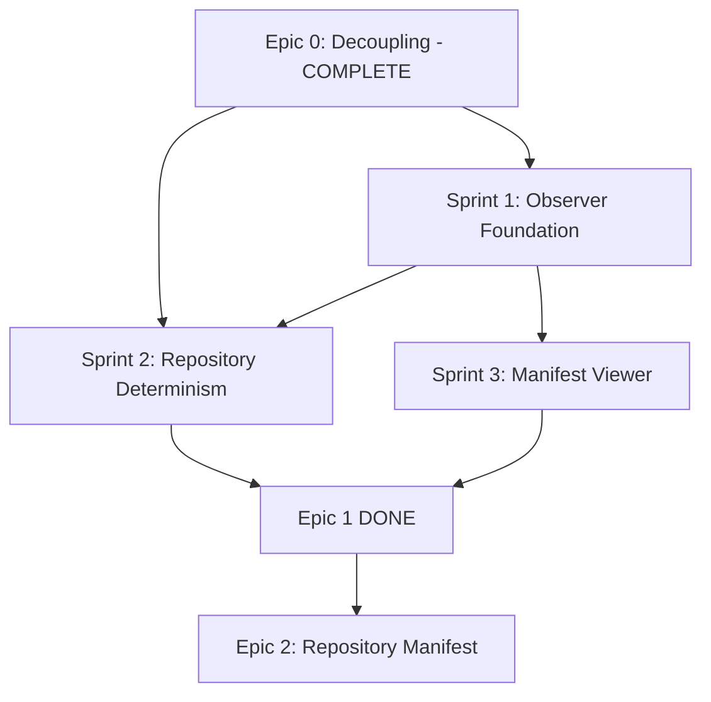

# Epic 1 — Repository Determinism: Redefinition

> **Status:** Redefined specification — supersedes original Epic 1 in [`docs/08-nexus-roadmap.md`](08-nexus-roadmap.md) §Epic 1
> **Date:** 29 July 2026
> **Predecessor:** [Epic 0 — Foundation (Complete)](09-epic-0-completion.md)
> **Original Specification:** [`docs/08-nexus-roadmap.md § Epic 1 — Source Observer`](08-nexus-roadmap.md)

---

## 1. Context: Why the Redefinition?

The original roadmap defined Epic 1 as "Source Observer — build 7 observers and produce RepositoryModel." With Epic 0 (Decoupling) complete and the project infrastructure solidified, the bar has been raised. This redefinition replaces a purely quantitative goal ("build 7 observers") with a **qualitative outcome**: repository determinism.

The milestone is no longer *"we observed a repository"* — it is *"we proved that observation is deterministic."*

### Epic 0 Deliverables (Baseline for Epic 1)

| Artifact | Status | Reference |
|----------|--------|-----------|
| 4 shared type modules with Zod schemas | ✅ Complete | [`src/shared/types/`](../src/shared/types/) |
| 4 subsystem directories with stub contracts | ✅ Complete | [`src/observer/`](../src/observer/), [`src/interpreter/`](../src/interpreter/), [`src/definitions/`](../src/definitions/), [`src/builder/`](../src/builder/) |
| Nexus CLI with all commands (stubs) | ✅ Complete | [`src/cli.ts`](../src/cli.ts) |
| 21 passing tests | ✅ Complete | Zero modifications to v2.0.3 pipeline |
| `RepositoryManifest` type + schema + 4 unit tests | ✅ Complete | [`src/shared/types/manifest.ts`](../src/shared/types/manifest.ts) |
| CSS observer (migrated from v2.0.3) | ✅ Complete | [`src/observer/css-observer.ts`](../src/observer/css-observer.ts) |

---

## 2. Architecture Decision: Two-Track System

Epic 1 is the first implementation of **Track B** within a broader two-track architecture. This decision was not explicit in the original roadmap; it is formalized here.

```
Track A: Nexus Runtime → OpenNexus → Experience
  Mission: "Rendere comprensibile la conoscenza"
  Output: Hub, Workspace, OpenNexus, Explorer, Knowledge Experience

Track B: Nexus Builder → Source Observer → Repository Manifest → Interpretation
  Mission: "Comprendere repository"
  Output: RepositoryModel, KnowledgeModel, Definitions
```

### Shared Contract (Only Contact Point)

The two tracks share **one and only one** contract surface:

- [`RepositoryManifest`](../src/shared/types/manifest.ts) — the versioned, checksummed interchange envelope
- Kernel types: `RepositoryModel`, `KnowledgeModel`, `ApplicationDefinition`, `PageDefinition`, `WidgetDefinition`

Everything else is track-internal. Track A never imports from Track B source directories, and vice versa. This constraint prevents the "big ball of mud" that the original monolithic pipeline suffered from.

---

## 3. Three Non-Negotiable Properties

These properties define the quality bar for Epic 1. Every deliverable, every test, and every acceptance criterion flows from them.

### Property 1: Repository Determinism

> **Same commit + same config → same `RepositoryManifest` (bit-for-bit identical).**

**Test:** Run `nexus observe` on the same repository **N** times (where N ≥ 10). Compute `sha256 manifest.json` on each run. All N hashes **must** be identical.

```
$ for i in $(seq 1 10); do
    nexus observe --source ./fixtures/tiny-app --output manifest.$i.json
    sha256 manifest.$i.json
  done
# All 10 hashes MUST match.
```

This property is the foundation of reproducibility. It means:
- Observation is a pure function of source code state
- Manifest diffs between commits are meaningful (they reflect only code changes)
- CI pipelines can cache and compare manifests safely
- No hidden state, no timestamps in node IDs, no random generation

### Property 2: Order Independence

> **Filesystem order A vs filesystem order B → identical `RepositoryManifest`.**

**Test:** Run `nexus observe` on the same repository, but feed file lists in different orders (e.g., `ls` vs `ls -r`). The output manifest must be identical.

This imposes hard constraints on observer internals:

- **Stable IDs:** IDs must not be derived from discovery order (no sequential counters like `page-001`, `page-002`).
- **Sorted collections:** All arrays in the manifest (`pages`, `components`, `imports`, `routes`, `tokens`, etc.) must be sorted deterministically before serialization.
- **Canonical JSON:** Serialization must produce deterministic output regardless of internal object creation order.

### Property 3: ID Stability

> **IDs must be derived from content and/or path, not from sequential counters.**

**Pattern:** `sha256(normalizedRelativePath)` truncated to a stable prefix, or the normalized relative path itself when guaranteed unique.

**Violation example (current code):**
```typescript
// src/observer/css-observer.ts — VIOLATES Property 3
let _tokenSeq = 0;
function nextTokenId(): string {
  _tokenSeq += 1;
  return `token-${_tokenSeq}`;  // NON-deterministic — depends on observation order
}
```

**Required replacement:** ID generation must move to a shared utility (`stable-id.ts`) that produces deterministic identifiers from content/path inputs. Sequential counters (`token-1`, `token-2`, `component-001`) are forbidden across the entire observer subsystem.

---

## 4. Canonical JSON Rules

Before computing checksums or writing manifests to disk, the observer **must** apply these canonicalization rules:

| Rule | Description |
|------|-------------|
| **Alphabetical key sort** | All object keys sorted alphabetically at serialization time |
| **Sorted arrays** | All collections (`pages`, `components`, `imports`, `routes`, `tokens`, `styles`, `apis`) sorted by their primary stable ID before serialization |
| **Stable `JSON.stringify`** | No whitespace variance; use a fixed indentation mode or no indentation at all |
| **Deterministic checksums** | `sha256(canonicalJson)` — the canonical form is the hash input, never the "pretty-printed" form |

### Implementation Strategy

A dedicated `canonical-json.ts` module in `src/observer/` will wrap `JSON.stringify` with:

1. A **custom replacer** that sorts object keys alphabetically
2. A **pre-serialization pass** that sorts all known collection arrays by their deterministic IDs
3. A **checksum function** that produces `sha256(canonicalJson)` via Node.js `crypto.createHash('sha256')`

This module is shared internally within Track B — it does not become part of the Kernel contract, because canonicalization is a serialization concern, not a type concern.

---

## 5. Three Golden Repositories

Golden repositories are pre-built fixture directories that serve as the acceptance test suite for the observer. Each contains an `expected.manifest.json` — the pre-computed, reviewed, and committed expected output.

### Golden Repository Specification

| Golden | Size | Purpose |
|--------|------|---------|
| `fixtures/tiny-app/` | ~3 pages, ~5 components, ~10 tokens | **Unit tests** — fast, minimal, covers all node types |
| `fixtures/openfav-reference/` | Frozen OpenFav v2.0.3 snapshot | **Regression** — catches observer drift against known real-world structure |
| `fixtures/opennexus-reference/` | Reduced OpenNexus snapshot | **Generality** — validates the model works across different framework conventions |

### Directory Structure (per golden repo)

```
fixtures/tiny-app/
├── src/
│   ├── pages/           # Page files (.astro, .tsx, etc.)
│   ├── components/       # Component files
│   └── styles/           # CSS/SCSS files with design tokens
├── package.json          # Framework detection signal
└── expected.manifest.json  # ⭐ Pre-computed expected output
```

### Acceptance Pipeline

```
nexus observe --source ./fixtures/tiny-app --output actual.manifest.json
  → Compare actual.manifest.json to fixtures/tiny-app/expected.manifest.json
  → Deep equality (structural, not referential)
  → PASS if identical; FAIL with structured diff if not
```

The [`expected.manifest.json`](fixtures/tiny-app/expected.manifest.json) in each golden repo is **committed to version control** and treated as a test artifact. Any observer change that alters the output **must** be accompanied by a deliberate update to the expected manifest, with a clear explanation in the commit message of why the output changed.

---

## 6. Sprint Breakdown

Epic 1 is divided into three sprints, each with a concrete deliverable.

### Sprint 1: Observer Foundation

> **Deliverable:** `RepositoryModel` populated from pages, components, imports, tokens, and styles.

| File | Status | Description |
|------|--------|-------------|
| [`src/observer/css-observer.ts`](../src/observer/css-observer.ts) | ✅ Migrated (needs ID refactor) | CSS token extraction → `StyleNode[]`, `TokenNode[]` |
| [`src/observer/page-observer.ts`](../src/observer/page-observer.ts) | 🆕 New | Scan for page files (.astro, `page.tsx`, `index.tsx`) → `PageNode[]` |
| [`src/observer/component-observer.ts`](../src/observer/component-observer.ts) | 🆕 New | Scan for components → `ComponentNode[]` with props/exports |
| [`src/observer/import-observer.ts`](../src/observer/import-observer.ts) | 🆕 New | Parse import statements → `ImportNode[]`, build import graph |
| [`src/observer/framework-detector.ts`](../src/observer/framework-detector.ts) | 🆕 New | Analyze `package.json` + file patterns → `RepositoryMetadata.framework` |
| [`src/observer/route-observer.ts`](../src/observer/route-observer.ts) | 🆕 New (optional Sprint 1) | File-based routing detection → `RouteNode[]` |
| [`src/observer/index.ts`](../src/observer/index.ts) | 🔧 Needs implementation | Orchestrator: runs all observers, merges into `RepositoryModel` |

**Sprint 1 output:** Run `nexus observe --source ./fixtures/tiny-app` and get a valid `RepositoryModel` with pages, components, imports, tokens, and styles populated. `RouteNode[]` and `ApiNode[]` are optional for Sprint 1 (can be empty arrays).

### Sprint 2: Repository Determinism

> **Deliverable:** Repeatability tests, order independence tests, hash stability.

| File | Status | Description |
|------|--------|-------------|
| `src/observer/stable-id.ts` | 🆕 New | Hash-based ID generator: `deriveId(prefix, sourcePath)` → deterministic ID |
| `src/observer/canonical-json.ts` | 🆕 New | Sorted serialization + SHA-256 checksum |
| `src/observer/__tests__/determinism.test.ts` | 🆕 New | Run observer 10× → identical SHA-256 |
| `src/observer/__tests__/order-independence.test.ts` | 🆕 New | Different FS order → identical manifest |
| `src/observer/__tests__/id-stability.test.ts` | 🆕 New | IDs are stable across runs, derive from path/content |

**Sprint 2 output:** All three non-negotiable properties are verified by automated tests. The [`css-observer.ts`](../src/observer/css-observer.ts) sequential ID counters are replaced with [`stable-id.ts`](src/observer/stable-id.ts).

### Sprint 3: Manifest Viewer

> **Deliverable:** CLI inspection commands and HTML debug report.

| Feature | Command | Description |
|---------|---------|-------------|
| Text summary | `nexus observe --view` | Human-readable summary: page count, component count, token breakdown, framework detected |
| HTML report | `nexus observe --html` | Static `manifest-report.html` with collapsible sections, token tables, import graph visualization |

**Design constraint:** No React, no OpenNexus, no frontend framework. Pure HTML + inline CSS generated server-side. This is a **debugging tool**, not a product feature. The HTML report is generated by a standalone function that takes a `RepositoryManifest` and returns an HTML string.

---

## 7. Migration from Original Roadmap

The following table tracks what changed from the original Epic 1 specification in [`docs/08-nexus-roadmap.md § Epic 1`](08-nexus-roadmap.md).

### Carried Forward (unchanged)

| Original Deliverable | Sprint | Notes |
|----------------------|--------|-------|
| 1.1 `css-observer.ts` | Sprint 1 | Already migrated; needs ID refactor (sequential → deterministic) |
| 1.2 `framework-detector.ts` | Sprint 1 | Unchanged |
| 1.3 `page-observer.ts` | Sprint 1 | Unchanged |
| 1.4 `component-observer.ts` | Sprint 1 | Unchanged |
| 1.5 `route-observer.ts` | Sprint 1 | Basic file-based detection only; full routing AST analysis deferred |
| 1.6 `import-observer.ts` | Sprint 1 | Unchanged |
| 1.8 `index.ts` orchestration | Sprint 1 | Must now apply canonical JSON before output |
| 1.9 `nexus observe` CLI | Sprint 1 (base) + Sprint 3 (viewer) | Base command in Sprint 1; `--view` and `--html` flags in Sprint 3 |
| 1.10 Tests >90% coverage | Sprint 2 | Coverage target unchanged; determinism tests are additive |

### Deferred

| Original Deliverable | New Status | Reason |
|----------------------|------------|--------|
| 1.7 `api-observer.ts` | **Deferred** — not in Sprint 1 MVP | API endpoint detection requires AST-level parsing of fetch/axios calls; the MVP focuses on file-structure observables. Will be re-evaluated in a future sprint. |

### New Additions (not in original Epic 1)

| New Deliverable | Sprint | Rationale |
|-----------------|--------|-----------|
| `stable-id.ts` | Sprint 2 | Required by Property 3 — ID Stability |
| `canonical-json.ts` | Sprint 2 | Required by Property 1 — Repository Determinism |
| Determinism tests | Sprint 2 | Required by Property 1 and Property 2 |
| `nexus observe --view` | Sprint 3 | Debugging ergonomics |
| `nexus observe --html` | Sprint 3 | Visual inspection without a frontend |
| 3 golden repositories | Sprint 1–2 | Acceptance test infrastructure |

---

## 8. Definition of Done for Epic 1

Epic 1 is **complete** when every checkbox below is satisfied:

### Observer Functionality

- [ ] `nexus observe --source ./fixtures/tiny-app` produces valid `RepositoryManifest` JSON
- [ ] `RepositoryManifest` validates against [`RepositoryManifestSchema`](../src/shared/types/manifest.schema.ts) (Zod)
- [ ] Pages, components, imports, tokens, and styles are populated (non-empty arrays for tiny-app)
- [ ] Framework detection works (package.json analysis → correct framework tag)
- [ ] `manifest.checksums.repositoryModel` is a valid SHA-256 hash

### Determinism (Non-Negotiable)

- [ ] `nexus observe` repeated 10 times on the same source produces **identical** SHA-256
- [ ] Files processed in different order (e.g., `ls` vs `ls -r`) produces **identical** manifest
- [ ] All node IDs are derived from content/path — zero sequential counters in production code
- [ ] [`stable-id.ts`](src/observer/stable-id.ts) is the single source of truth for all ID generation
- [ ] [`canonical-json.ts`](src/observer/canonical-json.ts) handles all manifest serialization

### Golden Repositories

- [ ] All 3 golden repos pass: `actual.manifest.json` matches `expected.manifest.json` (deep equality)
- [ ] [`fixtures/tiny-app/expected.manifest.json`](fixtures/tiny-app/expected.manifest.json) exists and is committed
- [ ] [`fixtures/openfav-reference/expected.manifest.json`](fixtures/openfav-reference/expected.manifest.json) exists and is committed
- [ ] [`fixtures/opennexus-reference/expected.manifest.json`](fixtures/opennexus-reference/expected.manifest.json) exists and is committed

### Viewer (Sprint 3)

- [ ] `nexus observe --view` prints a readable text summary to stdout
- [ ] `nexus observe --html` generates `manifest-report.html` (static, no JS framework)
- [ ] HTML report renders correctly when opened in a browser

### Quality

- [ ] Test coverage >90% on `src/observer/`
- [ ] All 21 existing tests still pass (no regressions)
- [ ] All new observer tests are deterministic (no `setTimeout`, no random, no FS-order-dependent)

### Documentation

- [ ] Each observer module has a JSDoc header describing its input, output, and determinism guarantees
- [ ] Golden repo READMEs explain how to regenerate `expected.manifest.json` after deliberate changes

---

## 9. Dependency Graph



**Note:** In the original roadmap, Epic 2 (Repository Manifest) was a separate epic. With the redefinition, the manifest contract already exists from Epic 0, and the determinism guarantees that make it trustworthy are delivered within Epic 1. The original Epic 2 scope is partially absorbed here; the remaining Epic 2 work (manifest diffing, version migration, external tool integration) will be re-scoped when Epic 1 completes.

---

## 10. References

| Document | Path |
|----------|------|
| Original Roadmap | [`docs/08-nexus-roadmap.md`](08-nexus-roadmap.md) |
| Epic 0 Completion Report | [`docs/09-epic-0-completion.md`](09-epic-0-completion.md) |
| RepositoryModel Types | [`src/shared/types/repository.ts`](../src/shared/types/repository.ts) |
| RepositoryManifest Type | [`src/shared/types/manifest.ts`](../src/shared/types/manifest.ts) |
| Manifest Zod Schema | [`src/shared/types/manifest.schema.ts`](../src/shared/types/manifest.schema.ts) |
| CSS Observer (migrated) | [`src/observer/css-observer.ts`](../src/observer/css-observer.ts) |
| Observer Stub (needs impl) | [`src/observer/index.ts`](../src/observer/index.ts) |
| Manifest Unit Tests | [`src/shared/types/__tests__/manifest.test.ts`](../src/shared/types/__tests__/manifest.test.ts) |
| Observer Integration Test (placeholder) | [`tests/integration/observer-pipeline.test.ts`](../tests/integration/observer-pipeline.test.ts) |
